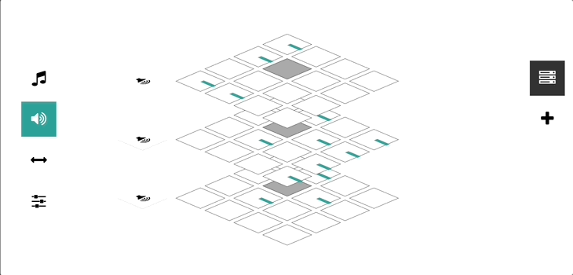

## Beeper



A music sequencer and synthesizer written entirely in JavaScript.

https://beeper-production.up.railway.app/

### Usage

```bash
# Clone this repository
git clone https://github.com/LucianBuzzo/beeper.git
# Go into the repository
cd beeper
# Install dependencies
npm install
```

To start the app run:

`npm start`
